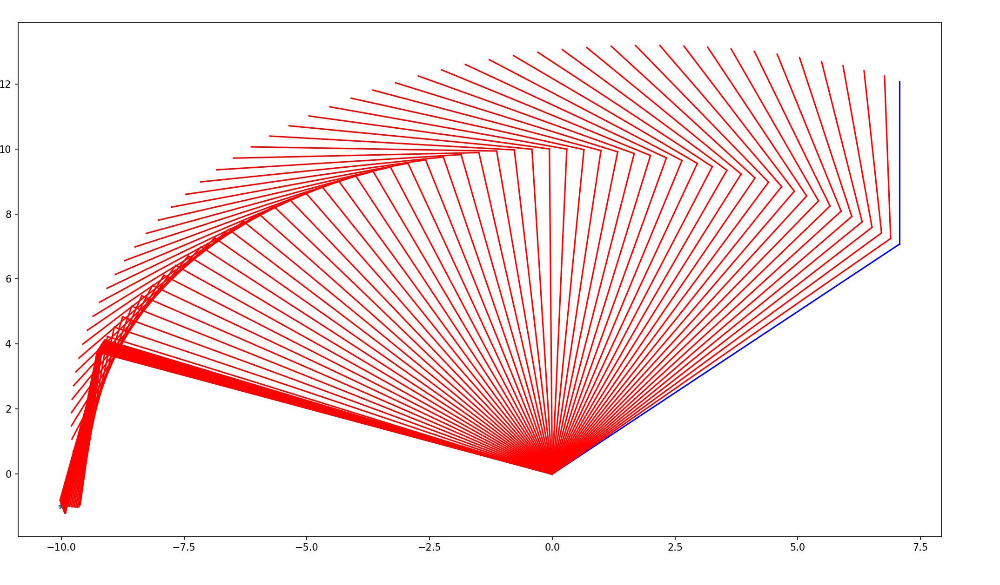

# Inverse Kinematics 
Simple implementation of the inverse kinematics theory applied to a robot arm.

## Requirements 

#### install dependencies
in order to install the libs required by this tool

```shell 
pip3 install -r requirements.txt
```

### Python version
```shell 
python 3.*
```


###  2D - 2 joints case 
 
