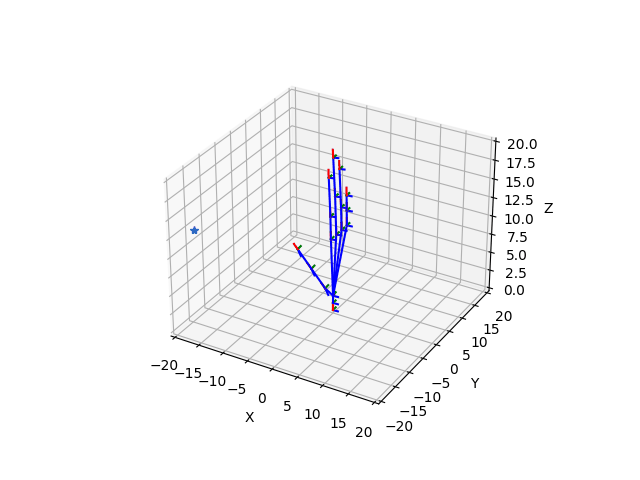

# Inverse Kinematics 
Dynamically create the geometry of a robot and apply IK onto it 

## Requirements 

in order to install the libs required by this tool

```shell 
pip3 install -r requirements.txt
```

### Python version
```shell 
python 3.*
```

## Configuration
The configs files (/resources/configs/*.yml) allow to dynamically create the robot structure (in the template below it is provided the example of a robot arm with 2 joints). In this tool a robot is considered as a set of bones connected by joints.

#### Config structure
``` yaml
Joints:  
    - id: 0
      actuators:     
          - type: ROTARY_ACTUATOR
            axis: 0
            start_angle: 0
            constraints:         
              min: -.inf 
              max: .inf
    - id: 1
      actuators: 
          - type: ROTARY_ACTUATOR
            axis: 0
            start_angle: 0
            constraints:         
              min: -.inf 
              max: .inf
    - id: 2
      actuators: []
Geometry:
  vertices:
      coords: [
        [0, 0, 0],
        [0, 0, 10],
        [0, 0, 20]    
      ]
      angles: [
        [0, 0, 0],
        [0, 0, 0],
        [0, 0, 0]    
      ]
  edges: [
    [1], [2], []
  ]
```

+ **Joints**: contains the list of joints.
    + **id**: numeric value (starting from index 0) that allows to map that joint into the robot geometry.
    + **actuators**: list of actuators associate to a joint.
      - **type**: type of actuator considered (only ROTARY_ACTUATOR is yet implemented)
        - **axis**: id of the joint basis axis considered as axis of rotation ([0, 1, 2] respectivelly x, y and z). 
        - **start_angle**: displacement (in terms of angle) from the zero position.
        - **contraints**: maximum and the minimum angles appliable by the actuator.

+ **Geometry**: contains informations about the robot geometry.
    + **vertices**:
      - **coords**: list of vectors describing the initial position of each joint (the joint id allows to map each joint to its location).
      - **angles**: displacement (in terms of angles) from the default alignment of the joint.      
    + **edges**: adjacency list representing the actual connection of the vertices (joints).

## Default joint basis alignment
the joint basis is aligned such that the z axis is the vector from the joint location to the child joint location (following the edges structure specified in the configuration file). If a joint have multiple childs than the mean of their locations is considered. 

## Execution
+ use yaml templates (contained in /resources/configs/) or create your custom configuration file.
+ set variable **CONFIG_PATH** into ***main.py***.
```python                    

CONFIG_PATH = os.path.join('.', 'resources', 'configs', 'armConfig - 3 joints.yml')

if __name__ == "__main__":    
    arm = ArmConfigParser(path=CONFIG_PATH).parse()    
```
+ execute the inverse_kinematics method:\
  where:
    - **target**: location of the target (numpy array)
    - **joints_id**: list of the ids corresponding to the joints 
    - **lr**: learning rate 
```python
robot.inverse_kinematics(target=np.array([x, y, z]), joints_id=id, lr=.0001)
```  

### Examples 
+ open file main.py
+ decomment the selected example  
+ run:

```shell 
python main.py
```

\
2 joints unconstrained\
 


3 joints unconstrained\
 


3 joints constrained\
 


hand\
 